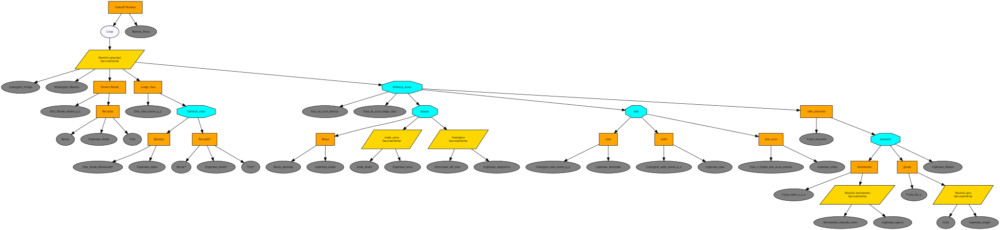

# Etapa 2 - Arquitetura e Modelagem

## Fluxograma de Software e Behavior Trees

Para o desenvolvimento de um software complexo como o do robô I-C, é fundamental usar uma estrutura que organize a lógica e o fluxo de controle. Embora os fluxogramas tradicionais sejam comuns para visualizar a sequência de decisões e ações, eles podem ser inflexíveis para sistemas reativos e autônomos. As Behavior Trees (BTs) são uma arquitetura moderna que funciona como um "fluxograma hierárquico" para sistemas autônomos. Elas permitem que a lógica de controle seja estruturada de forma modular, clara e escalável, o que facilita a transição entre tarefas e a reação dinâmica a eventos do ambiente. Para o projeto I-C, a BT é o "cérebro" que orquestra todos os comportamentos, desde a navegação até a interação social.

### O que é uma Behavior Tree?

Uma Behavior Tree (BT), ou Árvore de Comportamento, é uma arquitetura de controle hierárquica utilizada para estruturar a lógica de um agente autônomo, como um robô. Ela oferece uma maneira modular e escalável de organizar comportamentos complexos, garantindo que o agente execute tarefas de forma confiável e reativa ao ambiente. A execução de uma BT começa no nó raiz, que envia "ticks" (sinais de ativação) aos seus filhos em uma frequência constante.

Cada nó, ao ser ativado, retorna um de três possíveis status ao seu pai:
* **Running**: A tarefa está em andamento.
* **Success**: A tarefa foi concluída com sucesso.
* **Failure**: A tarefa falhou.

### Tipos de Nós da Behavior Tree

A lógica de uma behavior tree é construída com dois tipos principais de nós: Nós de Controle e Nós de Execução.

#### Nós de Controle

Esses nós orquestram o fluxo de execução de seus filhos, sem executar tarefas diretamente.

* **Nó de Sequência (→)**: Executa seus filhos da esquerda para a direita. Ele retorna Success apenas se todos os filhos retornarem sucesso. Se um filho retornar Failure ou Running, o nó de sequência interrompe a execução e retorna o mesmo status ao pai. É ideal para tarefas com passos obrigatórios.
* **Nó de Falha Alternativa (ou Seletor) (?)**: Executa seus filhos da esquerda para a direita. Ele retorna Success assim que o primeiro filho retornar sucesso. Se um filho retornar Running, ele também retorna Running ao pai. Só retorna Failure se todos os filhos falharem. É usado para tentar alternativas até que uma dê certo.
* **Nó Paralelo ()**: Executa todos os filhos simultaneamente. O status de retorno é definido por regras pré-configuradas. Por exemplo, ele pode retornar Success se uma quantidade mínima de filhos for bem-sucedida.
* **Nó Decorador (δ)**: Modifica o comportamento de um único nó filho, como, por exemplo, repetindo sua execução até que ele falhe ou limitando o tempo de execução.

#### Nós de Execução

Estes são os nós folha da árvore, responsáveis por realizar ações concretas ou avaliar o estado do sistema.

* **Nó de Ação**: Executa uma tarefa específica, como mover o robô, acionar um atuador ou exibir uma mensagem. Retorna Success, Failure ou Running.
* **Nó de Condição**: Avalia uma situação específica do sistema, como "a bateria está baixa?". Retorna Success se a condição for verdadeira ou Failure se for falsa. Não retorna Running, pois a verificação é instantânea.

## Estrutura Geral da Árvore

A árvore apresentada pode ser dividida em ramos principais, com prioridade definida de cima para baixo e da esquerda para a direita. O robô irá executar as ações de forma sequencial, priorizando os ramos mais importantes.

### Análise Detalhada do Loop Principal

A lógica central do comportamento do robô pode ser encapsulada em um nó Decorador de Repetição, que atua como um loop infinito. A única condição de saída desse loop seria um evento crítico, como a bateria baixa.

* **Decorator de Loop**: A árvore de comportamento poderia começar com um nó decorador que repete a execução de seu filho. O loop principal é interrompido apenas quando a condição de bateria baixa é detectada, fazendo com que o nó de seleção principal priorize o carregamento.
* **Nó Paralelo de Ações Simultâneas**: Dentro desse loop, o robô executa um nó Paralelo, que permite a execução de múltiplas tarefas ao mesmo tempo para uma resposta mais dinâmica:
    1.  **Monitoramento de Tempo**: Uma ação responsável por registrar e gerenciar o tempo de atividade sem interações externas.
    2.  **Verificação de Queda**: Uma sequência de nós verifica a distância do chão. Se a condição for verdadeira, o robô pode reagir com uma ação específica, como uma expressão de enjoo ou recuar para evitar uma queda.
    3.  **Monitoramento de bateria**: Uma ação responsável por registrar a porcentagem da bateria do robô.
    4.  **Gerenciamento de Interações**: Um nó Seletor gerencia as interações do robô. Ele contém três ramos principais:
        * **Ações Externas (do Usuário)**: Inclui interação com botões, verificação de empurrão e interação com o analógico.
        * **Ações Internas (do Robô)**: Ramo responsável por ações como a exploração do ambiente. Um nó Seletor pode decidir entre "brincar" e "descansar".
            * No modo "brincar", o robô realiza alguma ação aleatória, como movimento, dança ou ficar parado.
            * No modo de "descanso", o robô pode exibir uma Expressão de Sono ou uma expressão de tédio.

Quando a árvore sai do nó de Repeat, é acionado um aviso indicando a necessidade de retirar as baterias e colocá-las para carregar.

## Diagrama de Hardware

.jpg)

O diagrama de hardware do projeto I-C apresenta uma arquitetura eletrônica modular e escalável. A BitDogLab é o componente principal, orquestrando todas as operações do sistema.

### Módulo de Processamento e Controle

* **BitDogLab**: Atua como a Unidade de Processamento Central (CPU) do sistema embarcado. Ela é responsável pela execução do firmware do robô, incluindo a lógica da behavior tree. A BitDogLab gerencia interrupções, processa dados de sensores e gera os sinais de controle para os atuadores.

### Módulo de Sensoriamento e Percepção Ambiental

Este módulo é fundamental para a percepção do ambiente. A comunicação com os sensores é mediada por um extensor de barramento.

* **I2C Extender**: Um hub que facilita a conexão de múltiplos dispositivos I2C a um único par de pinos da BitDogLab. Ele simplifica a fiação e permite a fácil integração de novos sensores.
* **Acelerômetro**: Sensor inercial que mede aceleração, inclinação e vibração. Suas leituras são cruciais para a detecção de eventos cinemáticos, como impactos ou oscilações, que a behavior tree utiliza para disparar comportamentos reativos.
* **Sensores de Distância a Laser**: Sensores de medição de distância baseados em tecnologia laser. Eles fornecem dados de proximidade precisos, essenciais para a navegação autônoma. O uso de dois sensores permite uma percepção estéreo do ambiente, habilitando a detecção de obstáculos em ângulos distintos para o desvio de colisão.

### Módulo de Interação e Saída Visual (HMI)

Este módulo é a interface homem-máquina (HMI) do robô, responsável pela comunicação visual de estado e "personalidade".

* **SPI Extender**: Atua como um multiplexador para o barramento SPI, um protocolo de comunicação serial de alta velocidade. Ele centraliza a conexão e otimiza a comunicação entre a BitDogLab e a Tela LCD.
* **Tela LCD**: Display visual que atua como o principal meio de saída. Conectada via SPI, ela exibe as animações e expressões que dão vida ao robô, atendendo ao requisito de "Expressividade" do projeto.

### Módulo de Mobilidade e Atuação

Este módulo traduz os comandos lógicos da BitDogLab em movimento físico.

* **Ponte H**: Circuito eletrônico que controla a polaridade e a magnitude da tensão aplicada aos motores. Recebe sinais de controle PWM da BitDogLab e, com uma fonte de energia externa, controla a direção e a velocidade dos Motores DC.
* **Motores DC**: Atuadores elétricos que convertem energia elétrica em movimento rotacional. O diagrama indica dois motores, uma configuração comum em robôs com tração diferencial. O controle independente da velocidade de cada motor permite que o robô realize movimentos de avanço, ré e curvas.

### Fluxo de Dados e Controle

O fluxo de controle do sistema segue um ciclo contínuo:
1.  **Sensoriamento**: Os sensores I2C (Acelerômetro, Sensores de Distância) coletam dados do ambiente e os enviam ao I2C Extender.
2.  **Processamento**: A BitDogLab recebe e processa esses dados, atualizando o estado interno do robô.
3.  **Decisão**: A behavior tree executa sua lógica baseada no estado atual e nos dados de entrada, determinando a próxima ação a ser realizada.
4.  **Atuação**: A BitDogLab envia sinais de controle para a Ponte H (para os motores) e para o SPI Extender (para a tela LCD).
5.  **Feedback**: A Ponte H energiza os motores para movimentar o robô, e a Tela LCD exibe a resposta visual, completando o ciclo de percepção-decisão-ação do sistema.

Essa arquitetura robusta permite que o robô I-C se comporte de forma autônoma e reativa, integrando hardware de forma eficiente.

***
*Fábio Gabriel da Silva Barbosa, Grupo 16*