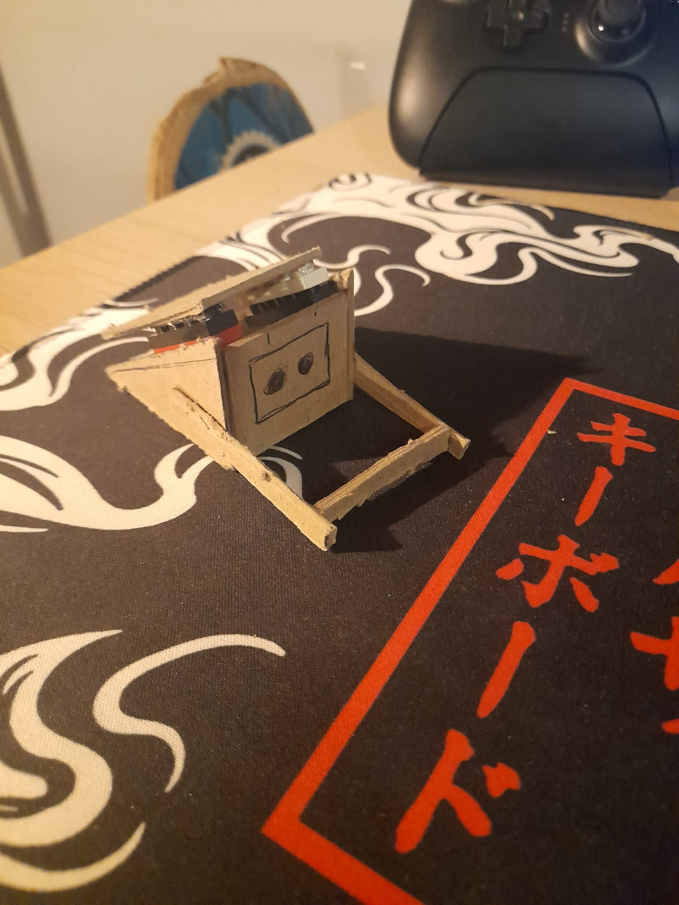

# Etapa 3 – Prototipagem e Ajustes

O início do desenvolvimento foi um pouco conturbado, pois diversas ideias planejadas inicialmente não funcionaram como esperado.

## Ajustes de Hardware

Nos primeiros testes com os periféricos, foi identificado um problema: os motores DC e a tela LCD compartilhavam os mesmos conectores. Apesar de existir um extensor SPI, ao utilizá-lo a ponte H não conseguia enviar e receber dados corretamente.

A BitDogLab até oferece outras opções de conexão, mas como não tenho experiência com soldagem, não me senti confortável em adicionar pinos extras na placa. Além disso, comecei a reconsiderar a própria necessidade de locomoção: como a proposta principal é que o robô seja um companheiro de mesa, a movimentação poderia até atrapalhar devido à limitação de espaço.

Por esses motivos, o escopo do projeto foi ajustado. O robô continuará sendo de companhia, mas agora será estático, sem a função de locomoção por motores DC.

## Ajustes de Software

Durante a implementação do software, outro desafio surgiu. Ao tentar integrar bibliotecas conhecidas de behavior trees, percebi que elas não eram compatíveis com o SDK do Raspberry Pi Pico W. Isso acontece porque essas bibliotecas dependem de recursos de sistemas mais completos, como a Raspberry Pi 5, e não funcionam em dispositivos embarcados mais simples.

Testei alternativas feitas para projetos embarcados, mas também sem sucesso. Assim, a solução adotada foi implementar manualmente a lógica das behavior trees, sem depender de bibliotecas externas. Apesar de mais trabalhoso, essa abordagem funcionou bem e atendeu às expectativas.

Até o momento, no software já foram desenvolvidos:

- **Nó de verificação de altura:** caso o robô esteja a mais de 20 cm do chão, ele entra no “modo medo” e exibe expressões faciais de medo enquanto permanecer nessa distância.
- **Um modelo base para as expressões:** a partir dele, todas as animações estão sendo construídas.
- **Nó de verificação de balanço:** caso o robô esteja sendo balançado o sensor de giroscópio vai detectar essa variação, o que aciona a expressão de enjoo.

Entretanto, ainda enfrento limitações na animação das expressões. Por falta de experiência com o controle da tela LCD, a troca de frames está muito perceptível, dando a impressão de “virar páginas”. Além disso, minha ideia inicial era usar bibliotecas de expressões já existentes para Arduino, mas tive dificuldades em adaptá-las ao SDK Pico. Assim, no momento, as expressões estão sendo desenvolvidas manualmente, uma a uma.

## Estrutura Física

A ideia inicial era construir a estrutura do robô em isopor. Porém, durante os testes, enfrentei dificuldades na colagem: nenhuma das colas disponíveis aderiu de forma satisfatória. Isso levou ao descarte do material.

Após buscar alternativas, o papel Paraná foi escolhido como base estrutural. Ele se mostrou robusto, maleável e adequado para o projeto. Além disso, decidi incorporar peças de Lego à estrutura, principalmente para fixação de componentes. Essa escolha traz algumas vantagens:

- Facilita a modificação da estrutura quando necessário.
- Permite remover a placa BitDogLab e outros componentes sem risco de danificar a base.
- Evita colagens permanentes em um material que, apesar de rígido, pode se fragilizar com remoções repetidas.

Abaixo, uma série de fotos da estrutura do protótipo:

Essa versão de estrutura que traz um formato de caixa para o robô, não é o conceito de como ele vai ficar na sua versão final, a ideia é que para a versão final ele fique parecido com essa estrutura que montei em miniatura, onde nela possui um mecanismo de encaixe com peças de lego, facilitando a remoção da parte de cima do robô para realização de manutenções futuras.

